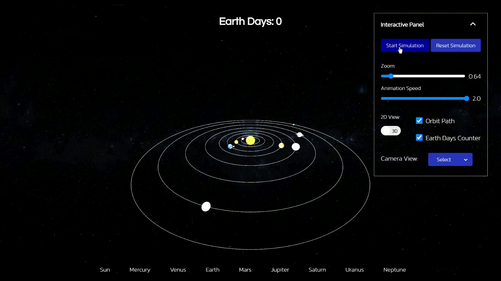

# Solar System Project - Three.js


## Table of Contents
- [Solar System Project](#solar-system-project---threejs)
  * [Description](#description)
  * [Features](#features)
  * [How to Use](#how-to-use)
  * [Development Stack](#development-stack)
  * [Acknowledgement](#acknowledgement)

## Description

This is an interactive 3D visualisation of the solar system, made with Three.js.The simulation accurately depicts the natural processes of planetary motion and gravitational interactions, allowing users to observe and understand the dynamic relationships among the planets, moons, and the sun.

## Features

- Celestial Body Representation:
    - Accurate portrayal of celestial bodies, including their sizes, colors, and textures.
    - Detailed visual representations of planets, moons, and the sun contribute to a realistic simulation.

- Orbital Motion Simulation:
    - Dynamic simulation of the orbital motion of planets and moons around the sun.
    - Realistic gravitational interactions provide an authentic experience of celestial bodies in motion.
  
- Interactive Navigation:
    - User-friendly controls for navigation and exploration of the solar system.
    - Zoom in/out features enable users to observe celestial bodies from varying perspectives.
  
- Information Display:
    - Essential information about each celestial body, such as name, distance from the sun, and orbital period, is displayed.
    - Users can gain insights into the characteristics and properties of the planets and moons.

- Interactive Experiments:
    - Engaging scenarios and experiments allow users to manipulate variables and observe their impact on planetary motion.
    - Learn about gravity, orbital mechanics, and other celestial phenomena through interactive simulations.

## How to Use

1. Clone this repository to your local machine.

2. Make sure you have Node.js and npm installed.

3. Navigate to the `package.json` file and run this command:
    ```js
    npm install
    ```

4. Run this command to run the server:
    ```js
    node server.js
    ```

5. In your browser, copy and paste `http://localhost:3000` or simply typing `3000` should do the job!

## Development Stack

- HTML
- CSS
- JavaScript
  - [Node.js](https://nodejs.org/en)
  - [Three.js](https://threejs.org/)

 ## Acknowledgement

 I extend my sincere gratitude to [Elendee](https://github.com/elendee) for their contributions to this Three.js Solar System project. Their expertise and efforts were the key in refactoring and optimising the code, resulting in a more efficient program. Furthermore, I appreciate [Elendee](https://github.com/elendee)'s generosity in hosting the project on their website, serving as a accessible demo link.
